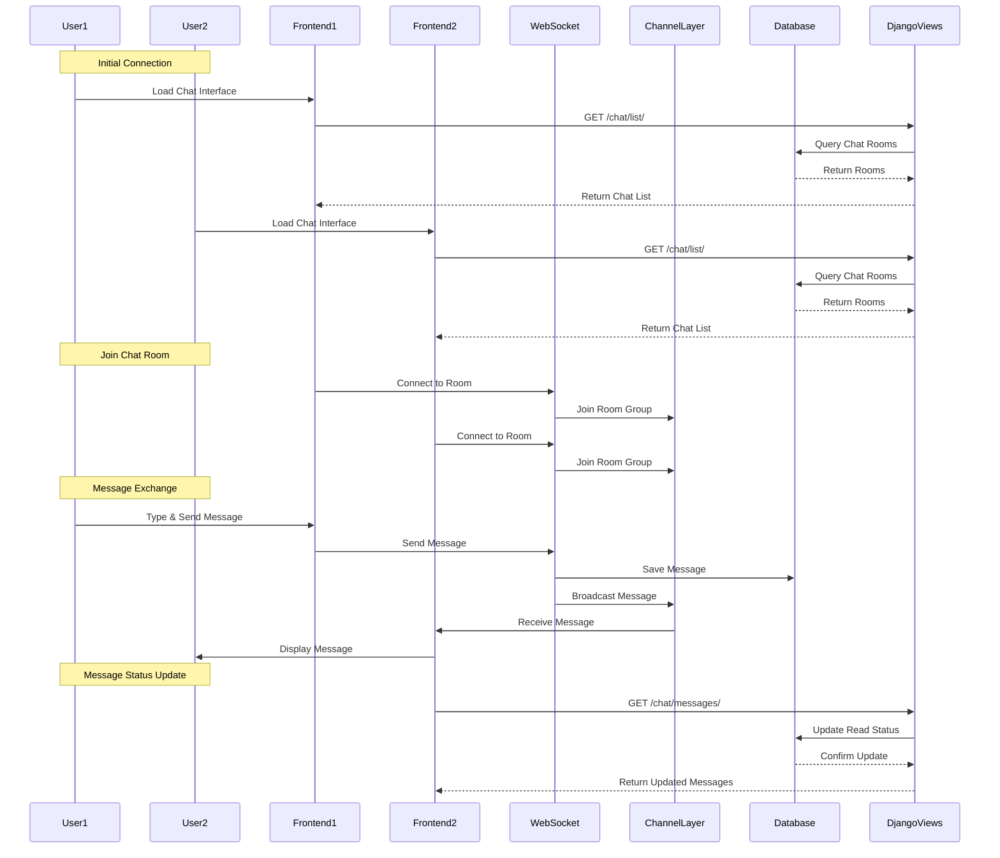

# Real-Time Chat System Documentation

## Overview
This document explains the architecture and implementation of the real-time chat system in the freelancing application. The system is built using Django and Django Channels, providing instant message delivery and real-time updates.

## Architecture

### Components
1. **Models**
   - `ChatRoom`: Represents a chat room between two users
   - `ChatMessage`: Stores individual messages with metadata

2. **WebSocket Consumer**
   - `ChatConsumer`: Handles real-time communication
   - Manages WebSocket connections
   - Broadcasts messages to room participants

3. **Views**
   - `ChatListView`: Lists all chat rooms for a user
   - `ChatMessagesView`: Retrieves messages for a specific room
   - `StartChatView`: Initiates a new chat between users

## Data Flow



## Implementation Details

### 1. Chat Room Management
- Each chat room is uniquely identified by a name in the format `chat_{user1_id}_{user2_id}`
- Rooms are created automatically when users start a conversation
- Participants are stored in a many-to-many relationship

### 2. Message Handling
- Messages are stored in the database with metadata (sender, timestamp, read status)
- Real-time delivery is handled through WebSockets
- Messages are ordered by timestamp
- Unread message count is tracked per room

### 3. Real-Time Features
- Instant message delivery using WebSockets
- Message read status tracking
- Online/offline status through WebSocket connections
- Message history persistence

### 4. Security
- Authentication required for all chat operations
- Room access restricted to participants only
- Custom login mixin ensures user authentication

## API Endpoints

### Chat List
- **URL**: `/chat/list/`
- **Method**: GET
- **Response**: List of chat rooms with last message and unread count

### Chat Messages
- **URL**: `/chat/messages/<room_name>/`
- **Method**: GET
- **Response**: All messages in a specific room

### Start Chat
- **URL**: `/chat/start/<user_id>/`
- **Method**: POST
- **Response**: New/existing chat room details

## WebSocket Connection
- **URL**: `ws://<domain>/ws/chat/<room_name>/`
- **Protocol**: WebSocket
- **Events**:
  - `connect`: Join chat room
  - `disconnect`: Leave chat room
  - `receive`: Handle incoming messages
  - `chat_message`: Broadcast messages to room

## Database Schema

### ChatRoom
```python
class ChatRoom(models.Model):
    name = models.CharField(max_length=255, unique=True)
    participants = models.ManyToManyField(User)
    created_at = models.DateTimeField(auto_now_add=True)
```

### ChatMessage
```python
class ChatMessage(models.Model):
    room = models.ForeignKey(ChatRoom, on_delete=models.CASCADE)
    sender = models.ForeignKey(User, on_delete=models.CASCADE)
    content = models.TextField()
    timestamp = models.DateTimeField(auto_now_add=True)
    read = models.BooleanField(default=False)
```

## Best Practices
1. Messages are persisted to ensure history
2. WebSocket connections are properly managed
3. Room access is restricted to authorized users
4. Message ordering is maintained
5. Unread message tracking is implemented
6. Profile images are properly handled 